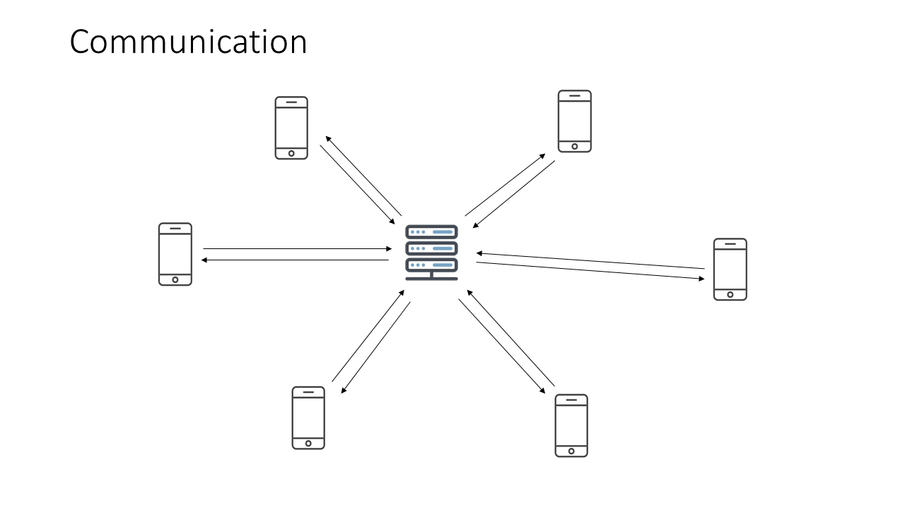

# Framework Architecture

Soba's architecture utilizes the standard workings of sockets in chat applications. Using socket.io's engine for back-and-forth communication between clients, the application does not require a database by design, but can include one for future extensions.

This is achieved by having the game's state be stored on every client's device, since this is designed for turn-based or slower-paced web games, simultaneous actions from different players are not expected.

The backend is designed to be more light-weight, only providing socket listeners which emits messages respectively, as well as REST endpoints to handle game-specific events.
Most of the code load is centered on the front-end of the application (ReactJS). This framework is designed for purely functional components and hence uses hooks instead of state. 

PS: A future addition to support redux in the workings.

Much like chat applications, the standard direction of flow is back-and-forth with the devices and the server.

Since every client (player's device) stores the game's current state, everytime a player does an action that changes the state of the game, it has to broadcast the new game state to be updated in all devices.
Every client is always listening for incoming changes to the gamestate. 
This is the fundamental method that gamestate is maintained throughout all devices.

Upon loading the application, the application makes a connection to the backend via websocket, retrieving a socketId value that will be the player's identifier.

Soba games' flow start with a player (the host) creating a room. 
This is the creation of the first iteration of the gameState object (that will be passed and changed).
In the example diagram above, the client makes a REST post request containing the room configuration to a backend that then generates the random roomCode, and returns the populated gameState.
This gameState can also be created in the front-end optionally.
After this, using socket.io's room engine, it will then put the player into the socket room using the roomCode as the identifier.

The diagram shows the flow of a non-host player joining an existing room. 
In the 'broadcast to everyone' block, it only emits the message to everyone inside the specified roomCode.

Since the gameState isn't stored on a database nor the server in memory, it has be retrieved from the host.
Therefore, the host would receive a new joiner, modify the gameState accordingly and broadcasting it to everyone (including the new joiner).

After every player has joined the game, the game's flow consists of merely bouncing gameState's to everyone as individual players performing actions that changes the gameState.

